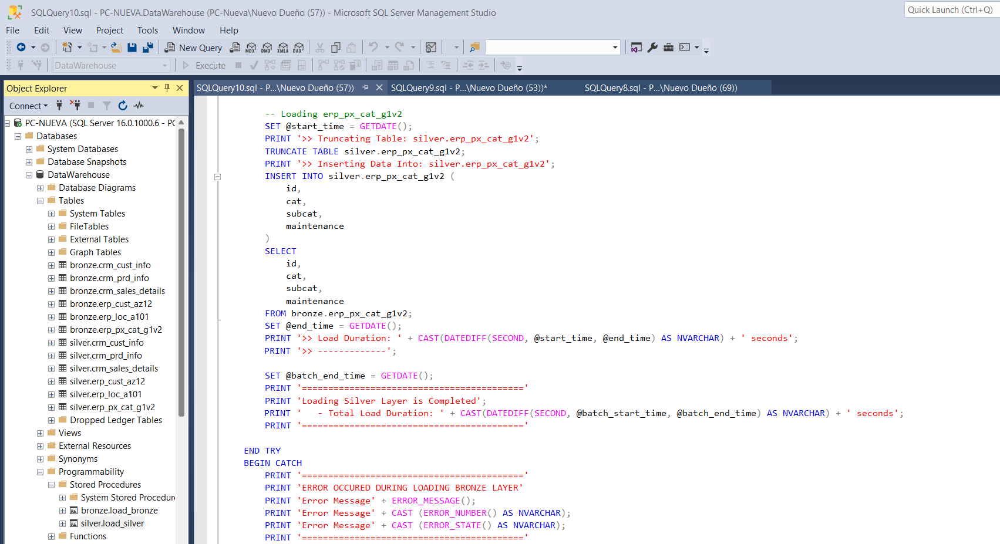
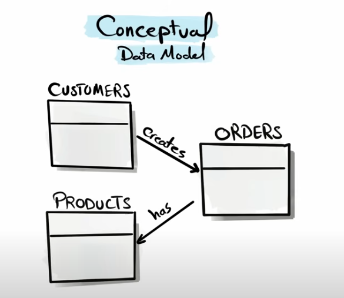
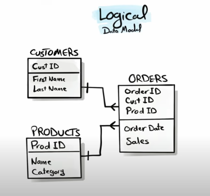
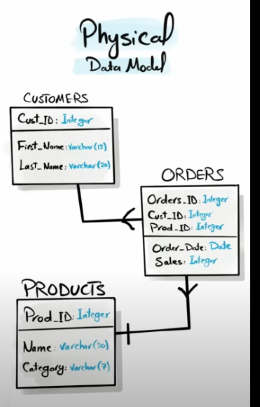
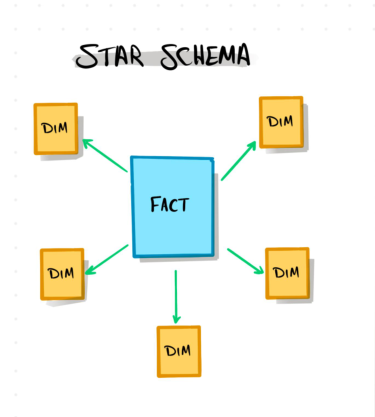
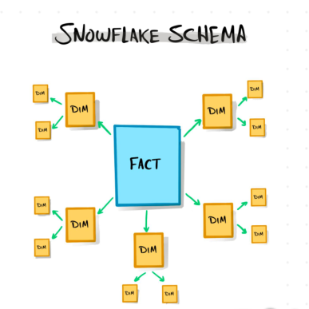
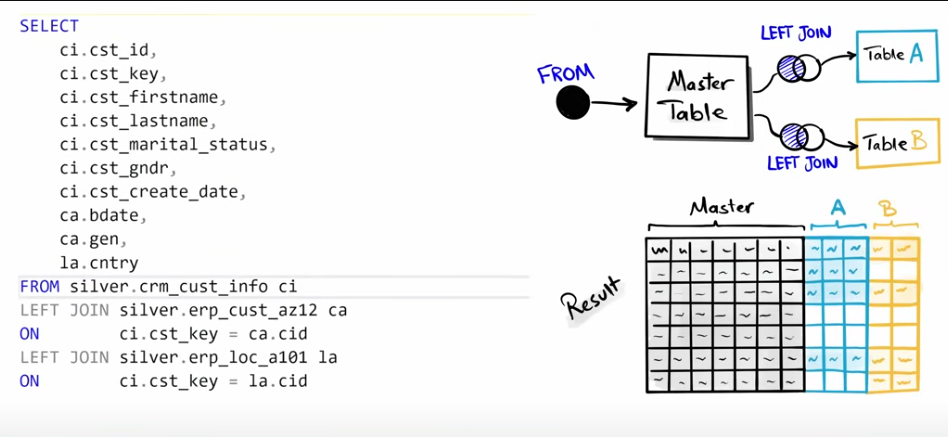

# SQL_DATAWAREHOUSE

In this project we build a datawarehouse with the help of some csv files, MSSQL Server, Python. The whole idea is to show an ETL process where the data architecture is organized in layers (bronze, silver and gold) known as Medallion Architecture, and the data after wrangling is injected into a DB in MSSQL Server.

1. **Bronze Layer**: Stores raw data as-is from the source systems. Data is ingested from CSV Files into SQL Server Database.
2. **Silver Layer**: This layer includes data cleansing, standardization, and normalization processes to prepare data for analysis.
3. **Gold Layer**: Houses business-ready data modeled into a star schema required for reporting and analytics.

This project involves:

1. **Data Architecture**: Designing a Modern Data Warehouse Using Medallion Architecture **Bronze**, **Silver**, and **Gold** layers.
2. **ETL Pipelines**: Extracting, transforming, and loading data from source systems into the warehouse.
3. **Data Modeling**: Developing fact and dimension tables optimized for analytical queries.
4. **Analytics & Reporting**: Creating SQL-based reports and dashboards for actionable insights.

Note: Regarding naming conventions we decided to use: nameoflayer_sourcesystem_nameoffile

## Bronze Layer
The part where we load the data from the csv into the tables in the bronze Layer is critical, we have to make sure there is a 100% match after performing the bulk insert, which by the way means inserting data in a massive way all at once.
By referring to a 100%match I mean exact correspondence between name fields and the content of the table. 

Having in mind that this loading task is going to become repetitive, we think it is convenient to write a stored procedure for the injection of data into the tables, this procedure is added some print messages to make the debugging easier for the DBA. There is also a try-catch session. It is also adviseable to keep track of the time each task takes in order to detect bottle necks or any other issues that may arise during execution.

 ## Data flow Diagram

 This diagram is built and included in the documentation in order to help us keep track of the flow of data in the whole operation and also it is useful to help us see where data comes from and where it ends. Also there is the concept of Data Lineage involved in this task.

## Silver Layer
In this stage we have to make a EDA to find out the relation among the data, key fields, it is a good practice to make a diagram of the entities and their relation, for example, the tables from CRM and the ones from ERP.
Now in the Silver layer we replicate the tables in the bronze layer but we add some metadata like creation Date.
Now the primary goal here is to check for duplicates, null values (especially in Primary Keys), extra spaces in string fields. We also care about data normalization, eg. M or F in Gener should be  Male or Female.
In order to insert the correct data into the silver Table we take or select the right data from the bronze table and execute those selects within an Insert statement. Later on this procedure becomes a stored procedure and we do an Exec statement for this procedure.

A different approach consists of copying the entire dataset into the silver layer and then performing the cleaning and wrangling using an update command on the silver layer tables to make the changes persistent.
For these complex SQL queries remember if you are not a master in SQL you can always resort to IA to help you build the complex sql query you need.

The third approach is to use Python pandas to perform this task. We connect Pandas to the Server and download the data.
(As a matter of fact in some cases the cleaning and ordering of data can be done with SQL, Pandas or PowerBI).

## Data Modeling
Taking the raw data and organizing it, structiring it in a meaningful way.That is to say we take the tables we have previously uploaded and cleaned and we will build new objects with them. In our case the entities are:

* Customers  
* Orders  
* Products  

Each of them with a primary key.  
   
A data model can be approached in 3 different ways:

   

Now regarding traditional data models for reporting we have:   

*Star Schema   
*Snowflake Schema   (the dimension tables are broken into smaller dimensions)

Both of them are popular these days but they have been present in DB Theories for many many years.

   

* Dimension Table: It contains data that is descriptive and it gives context to the facts table. E.g. we could have a dimension table for Products or Customers.  

* Facts Table: They are events, like transactions. They contain multiple id's which are the connections to the dimension tables.

## Gold Layer  

Here we identify the business objects based upon the entities we detected in the previous layers.

Products  
Customer  
Sales  

Now what we have to do is to join, the 3 tables that contain customer table in order to build only 1 entity or object.

   

